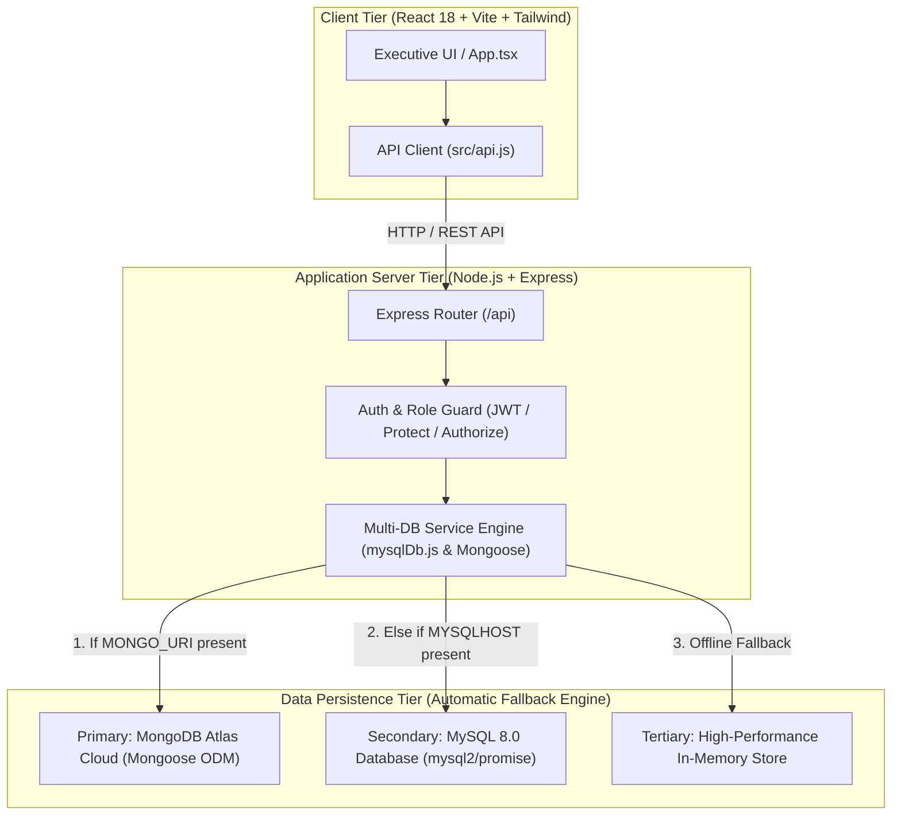
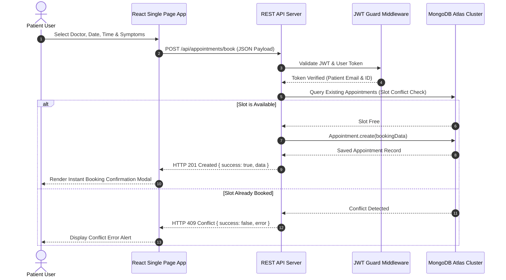
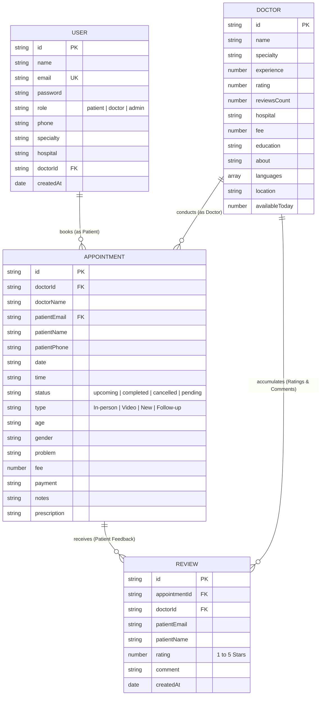

# MedConnect - Hospital & Healthcare Appointment Booking System


**MedConnect** is a full-stack, enterprise-grade hospital appointment booking and clinical management application. Designed for high availability and clean corporate UI responsiveness across all screen sizes (mobile, tablet, desktop), MedConnect features a **triple-tier database fallback engine** (MongoDB Atlas Cloud -> MySQL -> In-Memory Fallback Store), JWT authentication with role-based access control (Patient, Doctor, Admin), clinical prescription generation, and automated cloud seeding.

---

## 🏗️ System Architecture

### High-Level System Topology



---

## 🔄 Patient Booking Sequence Diagram



---

## 📊 Entity Relationship Diagram (ERD)



---

## ✨ Key Features

### 👤 1. Patient Portal
- **24x7 Doctor Directory**: Filter specialists by medical domain (`Cardiology`, `Neurology`, `Orthopedics`, `Pediatrics`, `Dermatology`, `ENT`, `General Medicine`), city location, consultation fee range, and star rating.
- **Instant Slot Booking**: Real-time conflict checking prevents double bookings.
- **Patient Dashboard**: Track upcoming appointments, view doctor prescriptions and clinical notes, cancel bookings, and submit verified 1-to-5 star patient reviews.

### 🩺 2. Doctor Portal & Registration
- **Detailed Registration**: Register custom doctor profiles specifying Medical Qualifications (`MBBS, MD, DM`), Years of Experience, Consultation Fee (₹), Hospital / Medical Center Name, City Location, and Professional Bio.
- **Clinical Workspace**: Manage daily consultations, update status to `Completed` or `Cancelled`, toggle live availability slots today, and write patient prescriptions and clinical diagnosis notes.

### 🛡️ 3. Master Admin Panel
- **Master Metrics**: View platform analytics including total registered patients, total doctors, total appointments, revenue generated, appointment status breakdown, and specialty distribution.
- **Assignment Control**: View master doctor-patient assignment records across all clinical departments.
- **Directory Management**: Add new doctors or remove inactive specialists from the catalog.

---

## 📁 Repository Structure

```text
d:\project
├── backend/
│   ├── src/
│   │   ├── middleware/
│   │   │   ├── auth.js               # JWT Verification & Role Authorization
│   │   │   └── errorHandler.js       # Centralized Error Middleware
│   │   ├── models/
│   │   │   ├── Appointment.js        # Mongoose Appointment Schema
│   │   │   ├── Doctor.js             # Mongoose Doctor Schema
│   │   │   ├── Review.js             # Mongoose Review Schema
│   │   │   └── User.js               # Mongoose User Schema
│   │   ├── routes/
│   │   │   ├── admin.js              # Admin Dashboard Stats & Patient List
│   │   │   ├── appointments.js       # Booking, Cancellations & Clinical Notes
│   │   │   ├── auth.js               # Registration & Sign In Endpoints
│   │   │   ├── doctors.js            # Doctor Catalog Queries & Management
│   │   │   └── reviews.js            # Rating Submissions & Doctor Reviews
│   │   ├── services/
│   │   │   └── mysqlDb.js            # MySQL Pool Connection & Memory Store
│   │   └── server.js                 # Express Application Entrypoint & Mongo Connect
│   ├── package.json
│   ├── schema.sql                    # Relational Database Schema
│   └── test-backend.js               # Automated E2E Backend Test Suite
├── frontend/
│   ├── src/
│   │   ├── api.js                    # Relative REST API Client (/api)
│   │   ├── App.tsx                   # Main Executive Responsive UI Component
│   │   ├── index.css                 # Tailwind Design System Directives
│   │   └── main.tsx                  # React DOM Entry Point
│   ├── package.json
│   └── vite.config.js                # Vite Bundler & Development Proxy Configuration
├── Dockerfile                        # Multi-Stage Production Build Spec
├── .dockerignore                     # Build Exclusion Patterns
└── README.md                         # Project Documentation
```

---

## 📡 REST API Reference

### Auth Routes (`/api/auth`)
| Method | Endpoint | Access | Description |
| --- | --- | --- | --- |
| `POST` | `/api/auth/register` | Public | Register a new Patient or Doctor account |
| `POST` | `/api/auth/login` | Public | Authenticate user & receive JWT token |
| `GET` | `/api/auth/me` | Protected | Fetch current logged-in user profile |

### Doctor Routes (`/api/doctors`)
| Method | Endpoint | Access | Description |
| --- | --- | --- | --- |
| `GET` | `/api/doctors` | Public | Filter doctors by specialty, location, fee, rating, keyword |
| `GET` | `/api/doctors/:id` | Public | Fetch specific doctor profile |
| `POST` | `/api/doctors` | Admin | Create new doctor profile |
| `PUT` | `/api/doctors/:id` | Admin/Doctor | Update doctor fee, location, availability |
| `DELETE` | `/api/doctors/:id` | Admin | Delete doctor profile |

### Appointment Routes (`/api/appointments`)
| Method | Endpoint | Access | Description |
| --- | --- | --- | --- |
| `POST` | `/api/appointments/book` | Public/Protected | Book a consultation slot |
| `GET` | `/api/appointments/my/:email` | Public/Protected | Fetch patient appointment history |
| `GET` | `/api/appointments/doctor/:doctorId` | Public/Protected | Fetch doctor appointment schedule |
| `PATCH` | `/api/appointments/:id/cancel` | Public/Protected | Cancel appointment |
| `PATCH` | `/api/appointments/:id/clinical` | Protected (Doctor) | Save prescription and clinical diagnosis notes |

### Admin Routes (`/api/admin`)
| Method | Endpoint | Access | Description |
| --- | --- | --- | --- |
| `GET` | `/api/admin/stats` | Protected (Admin) | Retrieve platform metrics and revenue stats |
| `GET` | `/api/admin/patients` | Protected (Admin) | Retrieve list of registered patients |
| `GET` | `/api/admin/assignments` | Protected (Admin) | Retrieve master assignment records |

### Review Routes (`/api/reviews`)
| Method | Endpoint | Access | Description |
| --- | --- | --- | --- |
| `POST` | `/api/reviews` | Protected (Patient)| Submit star rating review for completed appointment |
| `GET` | `/api/reviews/doctor/:doctorId` | Public | Fetch all patient reviews for doctor |

---

## ⚙️ Environment Variables

Create a `.env` file inside `backend/` directory:

```env
# Server Port
PORT=5000

# Primary Cloud Database (MongoDB Atlas)
MONGO_URI=mongodb+srv://<username>:<password>@<cluster>.mongodb.net/?appName=medconnect

# JWT Token Security
JWT_SECRET=medconnect_super_secret_2026_change_me
JWT_EXPIRES=7d

# CORS Client Policy
CLIENT_URL=*

# (Optional) Secondary Relational Database (MySQL)
MYSQLHOST=localhost
MYSQLPORT=3306
MYSQLUSER=root
MYSQLPASSWORD=
MYSQLDATABASE=medconnect
```

---

## 🚀 Local Development Setup

### 1. Prerequisites
- **Node.js**: v20.x or higher
- **npm**: v9.x or higher

### 2. Clone Repository
```bash
git clone https://github.com/abhinav9m/Med-connect-Hospital-appointment-booking-system.git
cd Med-connect-Hospital-appointment-booking-system
```

### 3. Install & Start Backend
```bash
cd backend
npm install
npm run dev
# Backend API starts on http://localhost:5000
```

### 4. Install & Start Frontend (in separate terminal)
```bash
cd frontend
npm install
npm run dev
# Frontend Dev Server starts on http://localhost:5173
```

### 5. Execute E2E Integration Test Suite
```bash
cd backend
node test-backend.js
# Runs 13/13 automated E2E tests against live endpoints
```

---

## 🐳 Production Deployment (Docker & Railway)

### Deploying to Railway
1. Push repository to GitHub.
2. In **Railway Console**, click **New Project -> Deploy from GitHub repo**.
3. In **Variables** tab, set:
   - `MONGO_URI`: Your MongoDB Atlas Connection String
4. Railway will automatically build the multi-stage [`Dockerfile`](file:///d:/project/Dockerfile) and deploy the production runner.

---

## 📄 License

Distributed under the MIT License. See `LICENSE` for details.
